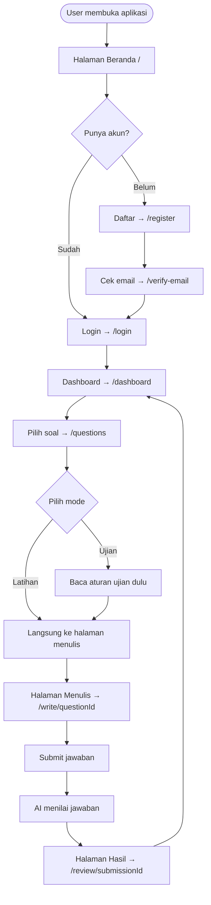
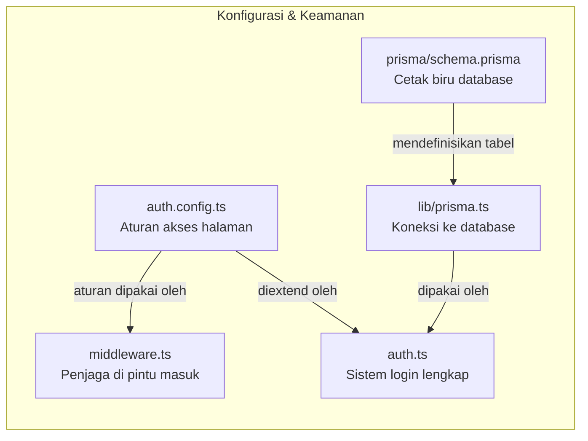
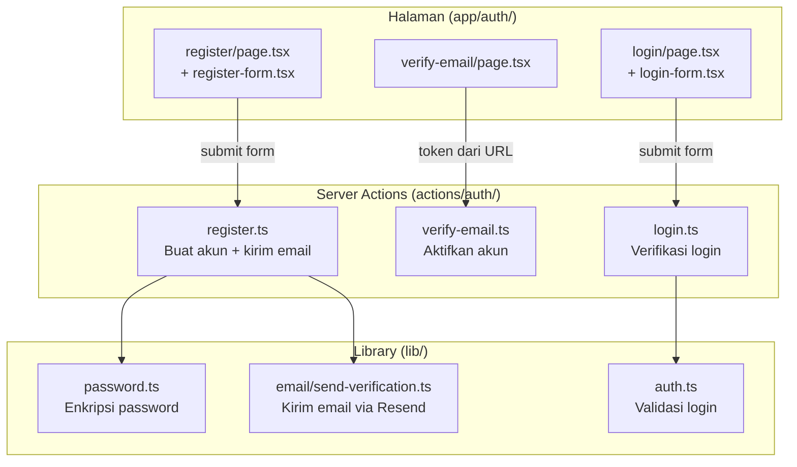
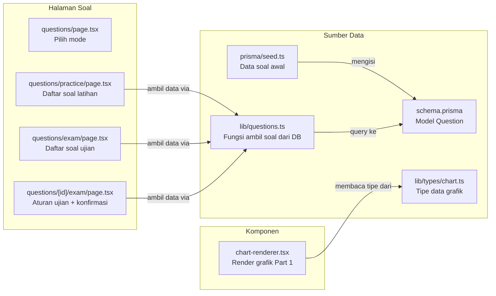
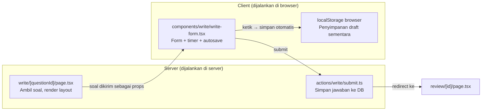
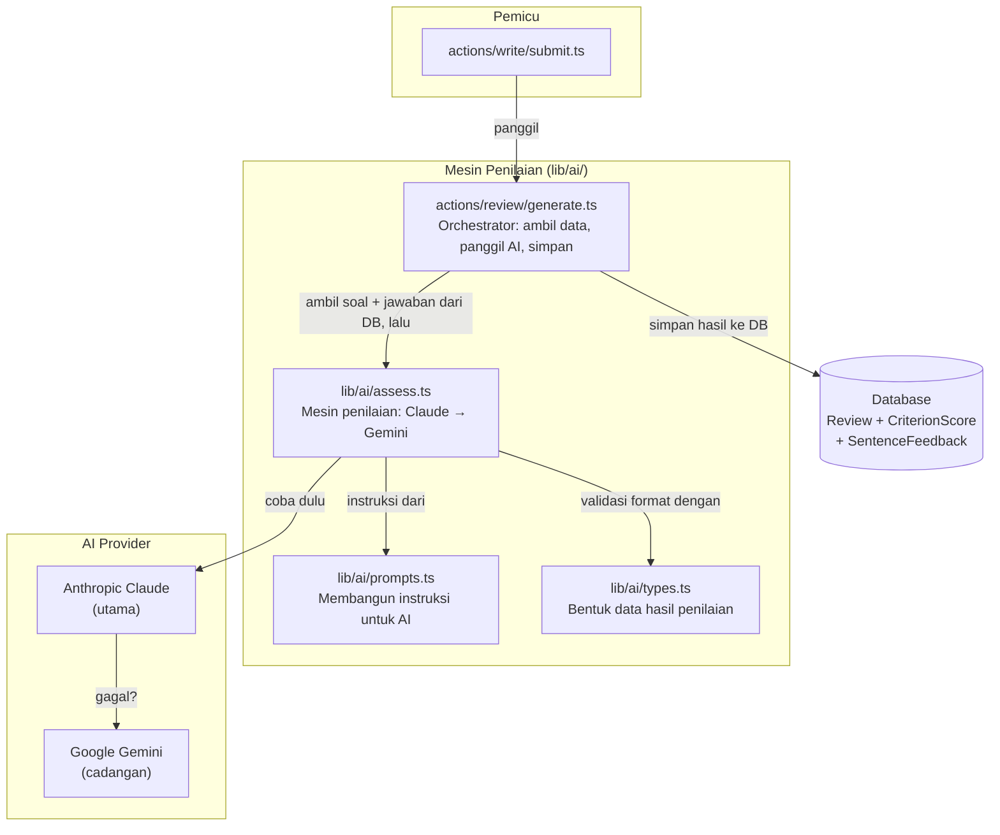
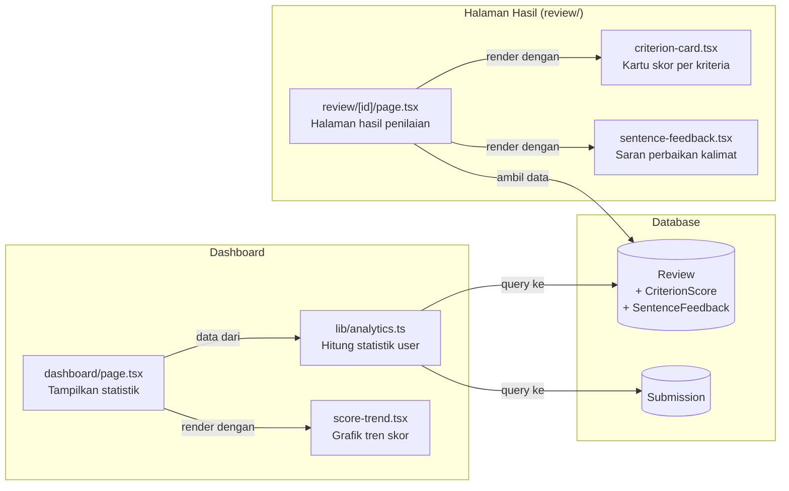
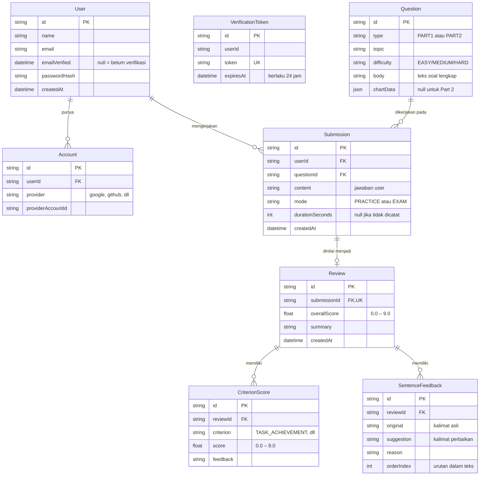

# Arsitektur Aplikasi Jalin — Panduan Memahami Codebase

> Dokumen ini menjelaskan cara kerja aplikasi Jalin secara menyeluruh.
> Ditulis untuk siapapun yang ingin memahami codebase ini — tidak perlu latar belakang teknis mendalam.
> Setiap bagian menjelaskan **apa yang terjadi**, **file mana yang terlibat**, dan **bagaimana file-file itu bekerja sama**.

---

## Cara Membaca Dokumen Ini

Aplikasi ini bekerja seperti sebuah gedung sekolah:
- **Database** adalah lemari arsip yang menyimpan semua data
- **Server** adalah staf sekolah yang memproses permintaan
- **Browser** adalah ruang kelas tempat siswa (user) berinteraksi
- **File `.ts` dan `.tsx`** adalah masing-masing staf atau ruangan dengan tugas spesifik

Setiap bagian di dokumen ini menjelaskan satu "area" gedung tersebut.

---

## Gambaran Besar — Perjalanan User dari Awal ke Akhir



**Singkatnya:** User daftar → verifikasi email → login → pilih soal → tulis jawaban → dapat penilaian AI → lihat hasilnya di dashboard.

---

## 1. Fondasi: Database, Koneksi, dan Penjaga Akses

Sebelum fitur apapun bisa berjalan, ada tiga hal yang harus ada:
1. **Cetak biru database** — mendefinisikan semua tabel dan relasinya
2. **Koneksi ke database** — satu pintu masuk yang digunakan oleh seluruh aplikasi
3. **Sistem keamanan** — memastikan halaman yang butuh login tidak bisa diakses sembarangan



### `prisma/schema.prisma`
**Apa ini?** File teks yang mendeskripsikan seluruh struktur database — tabel apa saja yang ada, kolom apa yang dimiliki setiap tabel, dan bagaimana tabel-tabel itu saling terhubung.

**Analogi:** Ini seperti denah rumah. Sebelum rumah dibangun, arsitek membuat denah dulu. `schema.prisma` adalah denah database Jalin.

**Penting:** Setiap kali file ini diubah, harus dijalankan `prisma generate` lalu `prisma db push` agar perubahan benar-benar terjadi di database.

---

### `lib/prisma.ts`
**Apa ini?** File yang membuat satu koneksi ke database dan memastikan koneksi itu tidak berulang-ulang dibuat ulang saat aplikasi berjalan.

**Analogi:** Bayangkan kantor yang punya satu resepsionis. Semua tamu harus melapor lewat resepsionis yang sama. `lib/prisma.ts` adalah resepsionis itu — satu pintu masuk ke database untuk seluruh aplikasi.

**Dipakai oleh:** Hampir semua file di `actions/` dan `lib/` yang perlu mengambil atau menyimpan data.

---

### `auth.config.ts`
**Apa ini?** Konfigurasi ringan yang mendefinisikan aturan akses halaman — halaman mana yang boleh diakses tanpa login, dan apa yang terjadi jika user yang belum login mencoba masuk ke halaman yang dilindungi.

**Analogi:** Ini seperti papan aturan di pintu masuk gedung: "Lantai 1 boleh siapapun. Lantai 2 ke atas hanya kartu anggota."

**Kenapa dipisah dari `auth.ts`?** File ini sengaja dibuat ringan karena digunakan oleh `middleware.ts` yang berjalan di lingkungan yang sangat terbatas (Edge Runtime) — tidak boleh ada kode berat seperti koneksi database di sini.

---

### `middleware.ts`
**Apa ini?** Kode yang berjalan **sebelum setiap halaman dimuat** — seperti penjaga keamanan di pintu masuk yang mengecek apakah pengunjung boleh masuk.

**Analogi:** Satpam gedung. Setiap orang yang datang dicek dulu. Jika belum punya akses, diarahkan ke halaman login.

**Cara kerjanya:** Middleware membaca aturan dari `auth.config.ts`, lalu memutuskan: apakah request ini boleh lanjut atau harus di-redirect?

---

### `auth.ts`
**Apa ini?** Konfigurasi sistem login yang lengkap — berisi logika verifikasi username/password, pembuatan sesi login (token JWT), dan penyertaan `id` user ke dalam sesi.

**Analogi:** Petugas keamanan full-service di resepsionis utama. Berbeda dengan `middleware.ts` yang hanya mengecek tiket, `auth.ts` bisa membaca database, memverifikasi password, dan mengeluarkan tiket masuk baru.

**Mengekspor:** `auth` (cek sesi), `signIn`, `signOut`, `handlers` (endpoint NextAuth).

---

## 2. Autentikasi — Daftar, Verifikasi Email, dan Login

Alur lengkap untuk user baru: isi form → data dikirim ke server → akun dibuat → email verifikasi dikirim → user klik link → email terverifikasi → bisa login.



### `app/(auth)/register/page.tsx` + `_components/register-form.tsx`
**Apa ini?** Halaman dan form pendaftaran akun baru. `page.tsx` adalah halaman utamanya, sedangkan `register-form.tsx` adalah komponen form-nya yang berjalan di sisi klien (untuk menampilkan error secara langsung tanpa reload halaman).

**Analogi:** Formulir pendaftaran di meja resepsionis.

---

### `actions/auth/register.ts`
**Apa ini?** Logika di sisi server yang memproses pendaftaran: validasi input, cek apakah email sudah terdaftar, buat akun baru, buat token verifikasi, dan kirim email.

**Analogi:** Staf yang memproses formulir pendaftaran — mengecek kelengkapan data, memasukkan ke database, lalu mengirim surat konfirmasi.

**Urutan kerja:**
1. Validasi format input (nama, email, password)
2. Cek apakah email sudah ada di database
3. Hash password (ubah ke bentuk terenkripsi)
4. Simpan user baru ke database
5. Buat token verifikasi yang berlaku 24 jam
6. Kirim email berisi link verifikasi

---

### `lib/password.ts`
**Apa ini?** Dua fungsi: `hashPassword` (mengubah password asli menjadi teks terenkripsi) dan `comparePassword` (membandingkan password yang diketik dengan yang tersimpan).

**Analogi:** Brankas satu arah — kamu bisa memasukkan sesuatu, tapi tidak bisa mengeluarkannya kembali dalam bentuk asli. Saat login, password yang diketik "dibrankas" dulu, lalu hasilnya dibandingkan dengan yang tersimpan.

**Kenapa tidak simpan password asli?** Jika database bocor, password asli tidak terbaca.

---

### `lib/email/send-verification.ts`
**Apa ini?** Fungsi yang mengirim email berisi link verifikasi ke user yang baru daftar. Di development (tanpa API key Resend), link ditampilkan di terminal. Di production, email dikirim via layanan Resend.

**Analogi:** Tukang pos — menerima surat (template HTML email) dan mengantarkannya ke alamat yang dituju.

**Dipakai oleh:** `actions/auth/register.ts`

---

### `app/(auth)/verify-email/page.tsx` + `actions/auth/verify-email.ts`
**Apa ini?** Halaman yang dibuka saat user klik link di email. Halaman ini otomatis mengambil token dari URL, mengirimnya ke server, dan server mengaktifkan akun.

**Analogi:** Loket konfirmasi — kamu datang bawa nomor tiket (token), petugas mengecek apakah tiket valid dan belum kadaluarsa, lalu membuka akses akunmu.

**Logika validasi di server:**
- Token tidak ada → link tidak valid
- Token sudah kadaluarsa (>24 jam) → minta daftar ulang
- Token valid → tandai email terverifikasi, hapus token

---

### `app/(auth)/login/page.tsx` + `_components/login-form.tsx` + `actions/auth/login.ts`
**Apa ini?** Halaman dan logika login. Form mengirim email + password ke server, server memverifikasi lewat `auth.ts`, dan jika berhasil user di-redirect ke dashboard.

**Penting:** User yang emailnya belum diverifikasi tidak bisa login — `auth.ts` menolaknya sebelum mencapai tahap pengecekan password.

---

## 3. Soal Latihan — Menyimpan dan Menampilkan Soal

Soal disimpan di database. Ada dua tipe: Part 1 (grafik/diagram) dan Part 2 (esai). User bisa memilih soal berdasarkan tipe dan mode (latihan atau ujian).



### `prisma/seed.ts`
**Apa ini?** Script yang mengisi database dengan soal-soal IELTS awal (10 soal). Dijalankan sekali saat setup, atau diulang jika database dikosongkan.

**Analogi:** Pengisian awal buku perpustakaan — tanpa ini, rak perpustakaan kosong dan tidak ada yang bisa dipinjam.

**Cara menjalankan:** `npx tsx prisma/seed.ts`

---

### `lib/questions.ts`
**Apa ini?** Berisi tiga fungsi untuk mengambil soal dari database: `getQuestions` (daftar soal dengan filter), `getQuestion` (satu soal lengkap), dan `getRandomQuestion` (soal acak).

**Analogi:** Pustakawan — kamu bilang apa yang kamu butuhkan, dia yang pergi ke rak dan mengambilkannya.

**Penting:** `getQuestions` sengaja tidak mengambil `chartData` dan `body` karena datanya besar — hanya dimuat saat dibutuhkan di halaman detail/menulis.

---

### `lib/types/chart.ts`
**Apa ini?** Mendefinisikan bentuk data grafik Part 1. Ada empat tipe: `bar` (batang), `line` (garis), `pie` (lingkaran), dan `table` (tabel). Setiap tipe punya struktur data yang berbeda.

**Analogi:** Daftar spesifikasi format — seperti panduan yang bilang "kalau grafik batang, data harus dalam format ini; kalau grafik lingkaran, format itu."

---

### `app/(main)/questions/page.tsx`
**Apa ini?** Halaman awal pemilihan soal — user memilih antara Mode Latihan atau Mode Ujian. Tidak menampilkan daftar soal, hanya dua pilihan mode.

---

### `app/(main)/questions/practice/page.tsx` dan `exam/page.tsx`
**Apa ini?** Daftar soal untuk masing-masing mode. Menampilkan topik, tipe (Part 1/2), tingkat kesulitan, dan berapa kali soal pernah dikerjakan.

**Perbedaan utama:**
- `practice/page.tsx` → klik soal langsung ke halaman menulis
- `exam/page.tsx` → klik soal dulu ke halaman aturan ujian, baru ke halaman menulis

---

### `app/(main)/questions/[id]/exam/page.tsx`
**Apa ini?** Halaman perantara khusus Mode Ujian — menampilkan aturan dan durasi ujian, lalu ada tombol "Mulai Ujian" yang baru membuka halaman menulis. Isi soal tidak ditampilkan di sini agar tidak bocor sebelum timer dimulai.

**Analogi:** Ruang tunggu sebelum ujian dimulai — peserta membaca tata tertib dulu sebelum soal dibagikan.

---

### `components/questions/chart-renderer.tsx`
**Apa ini?** Komponen yang merender data grafik Part 1 menggunakan library Recharts. Mendukung empat tipe grafik: batang, garis, lingkaran, dan tabel.

**Kenapa harus `'use client'`?** Recharts membutuhkan browser (DOM) untuk menggambar grafik. Komponen ini tidak bisa dijalankan di server.

**Dipakai oleh:** Halaman menulis (`write/[questionId]/page.tsx`)

---

## 4. Menulis Jawaban — Area Kerja Utama User

Halaman menulis adalah inti dari aplikasi. Di sinilah user menghabiskan sebagian besar waktunya — membaca soal, menulis jawaban, dan mengirimkannya.



### `app/(main)/write/[questionId]/page.tsx`
**Apa ini?** Halaman induk yang mengambil data soal dari database, lalu membagi tampilan menjadi dua panel: panel soal di kiri/atas dan panel menulis di kanan/bawah.

**Analogi:** Ruang ujian dengan dua meja — meja kiri berisi soal yang bisa dibaca, meja kanan adalah tempat menulis jawaban.

---

### `components/write/write-form.tsx`
**Apa ini?** Komponen form yang menangani semua interaksi user saat menulis: mengetik jawaban, menghitung kata, timer countdown (mode ujian), auto-save draft ke browser, dan tombol submit.

**Kenapa harus `'use client'`?** Komponen ini perlu state (isi jawaban, sisa waktu) dan efek samping (timer, localStorage) yang hanya bisa berjalan di browser.

**Fitur-fitur yang ada:**
- **Word count** — menghitung kata secara real-time, memperingatkan jika belum mencapai minimum IELTS
- **Timer** — hanya aktif di mode ujian. Part 1: 60 menit, Part 2: 40 menit. Saat waktu habis, form auto-submit
- **Auto-save** — setiap 2 detik setelah user berhenti mengetik, draft disimpan ke localStorage. Jika halaman tidak sengaja ditutup, draft bisa dipulihkan
- **Konfirmasi submit** — user harus klik dua kali (Kirim → Ya, Kirim) untuk mencegah submit tidak sengaja

---

### `actions/write/submit.ts`
**Apa ini?** Server Action yang menerima jawaban dari form, memvalidasi datanya, menyimpan ke database sebagai `Submission`, lalu meminta AI untuk menilai.

**Urutan kerja:**
1. Cek apakah user sudah login
2. Validasi input (jawaban tidak boleh kosong, mode valid)
3. Simpan `Submission` ke database
4. Panggil AI untuk menilai (jika AI gagal, submission tetap tersimpan — tidak hilang)
5. Redirect ke halaman hasil

**Penting:** AI dipanggil di dalam blok `try/catch` terpisah. Jika AI gagal, error tidak menggagalkan keseluruhan proses — jawaban user tetap tersimpan.

---

## 5. Penilaian AI — Otak Aplikasi

Setelah jawaban tersimpan, AI bekerja: membaca soal dan jawaban, menilai sesuai standar IELTS, dan mengembalikan hasil dalam format terstruktur yang bisa disimpan ke database.



### `lib/ai/types.ts`
**Apa ini?** Mendefinisikan bentuk data hasil penilaian AI: `AssessmentResult` (keseluruhan), `CriterionResult` (satu kriteria), dan `SentenceFeedbackItem` (satu kalimat yang perlu diperbaiki).

**Analogi:** Formulir rapor yang sudah ditentukan kolomnya — AI harus mengisi formulir ini dengan format yang tepat.

---

### `lib/ai/prompts.ts`
**Apa ini?** Dua fungsi yang membangun teks instruksi (prompt) untuk AI: `buildSystemPrompt` (instruksi umum cara menilai) dan `buildUserMessage` (soal + jawaban yang perlu dinilai).

**Penting tentang kriteria:** Part 1 menggunakan `TASK_ACHIEVEMENT` (akurasi deskripsi grafik), Part 2 menggunakan `TASK_RESPONSE` (kelengkapan argumen). Keduanya punya 3 kriteria yang sama: Coherence & Cohesion, Lexical Resource, Grammatical Range & Accuracy.

**Analogi:** Panduan penilaian untuk penguji — "Ini cara menilai, ini soalnya, ini jawaban siswanya. Sekarang nilai dan isi formulir rapor."

---

### `lib/ai/assess.ts`
**Apa ini?** Mesin penilaian utama. Mencoba Claude (Anthropic) dulu, jika gagal otomatis beralih ke Gemini (Google). Respons AI yang berupa teks JSON divalidasi formatnya sebelum dikembalikan.

**Analogi:** Penguji dengan dua asisten — penguji utama (Claude) ditanya dulu. Jika tidak bisa menjawab, asisten cadangan (Gemini) yang mengerjakan.

**Kenapa ada fallback?** API AI kadang gagal karena overload atau limit. Dengan dua provider, kemungkinan penilaian berhasil jauh lebih tinggi.

**Proses validasi:** AI mengembalikan teks JSON. Sebelum disimpan, format JSON dicek menggunakan Zod — jika strukturnya tidak sesuai, error dilempar dan dicoba provider lain.

---

### `actions/review/generate.ts`
**Apa ini?** Orchestrator penilaian — mengambil submission dari database, memanggil `assess()`, dan menyimpan hasilnya ke tiga tabel sekaligus dalam satu transaksi database.

**Analogi:** Manajer ujian — dia yang mengambil kertas jawaban dari arsip, memberikannya ke penguji, menerima hasil penilaian, dan memasukkan nilai ke semua kolom rapor secara bersamaan.

**Kenapa transaksi?** Agar tidak ada data setengah tersimpan. Jika penyimpanan `Review` berhasil tapi `CriterionScore` gagal, semua dibatalkan — lebih baik tidak ada data sama sekali daripada data tidak lengkap.

---

## 6. Hasil Penilaian & Dashboard — Melihat Progress

Setelah penilaian selesai, user bisa melihat hasilnya secara detail. Semua hasil latihan dikumpulkan di dashboard untuk melihat perkembangan dari waktu ke waktu.



### `app/(main)/review/[submissionId]/page.tsx`
**Apa ini?** Halaman yang menampilkan hasil penilaian lengkap untuk satu submission: overall band score, ringkasan AI, skor per kriteria, saran perbaikan kalimat, dan jawaban asli user.

**Keamanan:** Halaman ini mengecek apakah submission milik user yang sedang login. Jika bukan, halaman 404 ditampilkan — user lain tidak bisa melihat hasil latihan orang lain.

---

### `components/review/criterion-card.tsx`
**Apa ini?** Kartu yang menampilkan satu kriteria penilaian IELTS: nama kriteria (beserta singkatannya), band score, dan penjelasan detail dari AI. Warna badge skor mengikuti standar band IELTS (hijau ≥7, kuning ≥5.5, merah <5.5).

---

### `components/review/sentence-feedback.tsx`
**Apa ini?** Komponen yang menampilkan daftar kalimat dari jawaban user yang disarankan untuk diperbaiki — menampilkan kalimat asli, kalimat perbaikan, dan alasannya.

---

### `lib/analytics.ts`
**Apa ini?** Fungsi `getDashboardStats` yang menghitung semua statistik dashboard user dalam **satu query database**: total latihan, rata-rata skor, latihan minggu ini, rata-rata per kriteria, riwayat terbaru, dan tren skor.

**Kenapa satu query?** Lebih efisien daripada banyak query terpisah. Data diambil sekali, lalu dihitung di memori server.

**Analogi:** Akuntan yang mengambil seluruh buku kas sekaligus, lalu menghitung semua angka yang diperlukan dari satu sumber — bukan bolak-balik ke brankas untuk setiap pertanyaan.

---

### `app/(main)/dashboard/page.tsx`
**Apa ini?** Halaman dashboard yang memanggil `getDashboardStats`, lalu menampilkan hasilnya dalam tiga kartu ringkasan, grafik tren skor, progress bar per kriteria, dan riwayat latihan terbaru.

---

### `components/dashboard/score-trend.tsx`
**Apa ini?** Grafik garis yang memvisualisasikan tren overall band score dari waktu ke waktu. Menggunakan Recharts. Ada dua garis referensi putus-putus: Band 6 dan Band 7 sebagai target umum IELTS.

**Kenapa harus `'use client'`?** Sama dengan `chart-renderer.tsx` — Recharts butuh browser.

---

## 7. Struktur Database Lengkap

Berikut semua tabel di database dan bagaimana mereka saling terhubung:



**Cara membaca diagram:**
- `||--o{` berarti "satu ke banyak" — satu User bisa punya banyak Submission
- `||--o|` berarti "satu ke satu opsional" — satu Submission bisa punya nol atau satu Review

---

## 8. Struktur Folder Lengkap

```
jalin/
├── app/                              # Semua halaman aplikasi (Next.js App Router)
│   ├── (auth)/                       # Halaman autentikasi (tidak butuh login)
│   │   ├── register/                 # Halaman daftar
│   │   ├── login/                    # Halaman login
│   │   └── verify-email/             # Halaman verifikasi email
│   ├── (main)/                       # Halaman utama (butuh login)
│   │   ├── dashboard/                # Dashboard user
│   │   ├── questions/                # Daftar soal (+ subfolder exam & practice)
│   │   ├── write/[questionId]/       # Halaman menulis jawaban
│   │   └── review/[submissionId]/    # Halaman hasil penilaian
│   ├── api/auth/                     # Endpoint NextAuth (login/logout)
│   ├── layout.tsx                    # Layout global (font, metadata)
│   └── page.tsx                      # Halaman beranda
│
├── actions/                          # Server Actions — logika di sisi server
│   ├── auth/                         # register.ts, login.ts, verify-email.ts
│   ├── write/                        # submit.ts
│   └── review/                       # generate.ts
│
├── components/                       # Komponen React yang dipakai ulang
│   ├── questions/                    # chart-renderer.tsx
│   ├── write/                        # write-form.tsx
│   ├── review/                       # criterion-card.tsx, sentence-feedback.tsx
│   └── dashboard/                    # score-trend.tsx
│
├── lib/                              # Fungsi utilitas dan konfigurasi
│   ├── prisma.ts                     # Koneksi database (singleton)
│   ├── password.ts                   # Hash & verifikasi password
│   ├── questions.ts                  # Query soal dari database
│   ├── analytics.ts                  # Kalkulasi statistik dashboard
│   ├── ai/                           # Mesin penilaian AI
│   │   ├── assess.ts                 # Claude + Gemini fallback
│   │   ├── prompts.ts                # Instruksi untuk AI
│   │   └── types.ts                  # Tipe data hasil penilaian
│   ├── email/                        # Pengiriman email
│   │   └── send-verification.ts      # Email verifikasi via Resend
│   └── types/                        # Tipe data khusus
│       └── chart.ts                  # Tipe data grafik Part 1
│
├── prisma/                           # Konfigurasi database
│   ├── schema.prisma                 # Definisi tabel database
│   └── seed.ts                       # Data soal awal
│
├── auth.ts                           # Konfigurasi sistem login lengkap
├── auth.config.ts                    # Aturan akses halaman (Edge-safe)
├── middleware.ts                     # Penjaga akses setiap halaman
└── docs/                             # Dokumentasi (folder ini)
```
